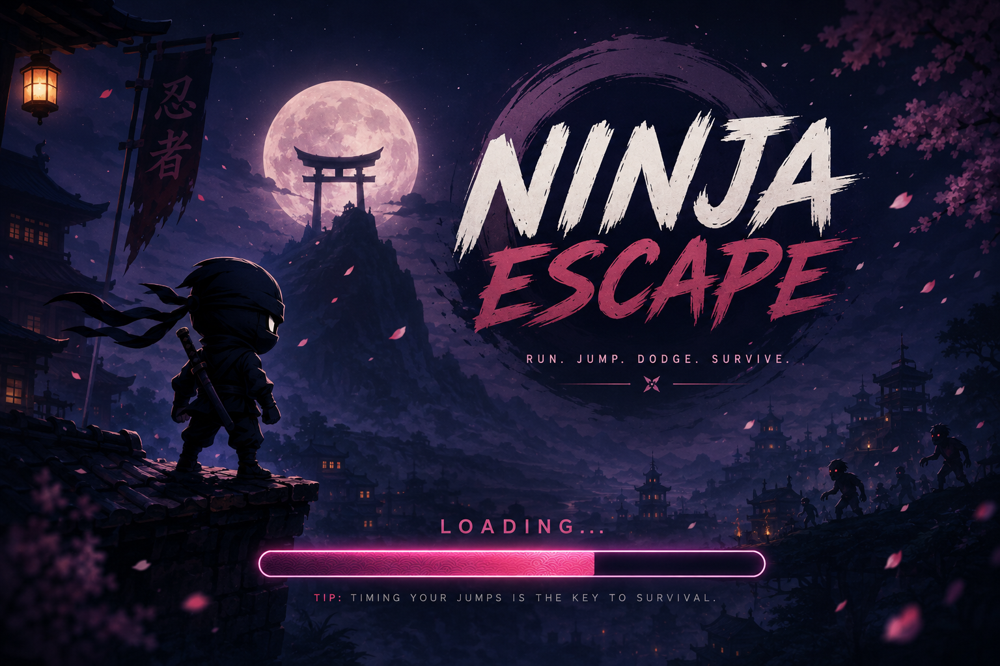

# 🥷 Ninja Escape

### 2D Platformer Game Built with Godot

A fast-paced 2D platformer where you play as a black ninja escaping a zombie-filled world. Run, jump, dodge enemies, and navigate challenging levels in a modern side-scrolling experience.

## 🎮 Play the Game

> **[▶️ Play Ninja Escape — Live Demo](YOUR_DEMO_LINK_HERE)**

**No installation required. Play directly in your browser.**

---

## 📸 Preview

<p align="center">
  
</p>

---

## ✨ Features

* 🥷 **Ninja Player**

  * Responsive movement
  * Jump-based platforming
  * Side-scrolling gameplay

* 🧟 **Zombie Enemies**

  * Enemy-filled levels
  * Dodge and survive enemy encounters

* 🏃 **Platforming Gameplay**

  * Fast-paced movement
  * Platform navigation
  * Challenging level layouts

* 🎨 **2D Game Environment**

  * Custom scenes and environments
  * Character and world assets
  * Animated gameplay elements

* 🌐 **Browser Playable**

  * Exported for the web using Godot
  * Runs directly in modern browsers

---

## 🕹️ Gameplay

The objective is simple:

**Reach the end of the level while avoiding enemies and environmental hazards.**

```text
        START
          │
          ▼
    ┌─────────────┐
    │ Explore     │
    │ the Level   │
    └──────┬──────┘
           │
           ▼
    ┌─────────────┐
    │ Jump &      │
    │ Navigate    │
    └──────┬──────┘
           │
           ▼
    ┌─────────────┐
    │ Dodge       │
    │ Enemies     │
    └──────┬──────┘
           │
           ▼
       🏆 ESCAPE
```

---

## 🎮 Controls

| Action     | Key       |
| ---------- | --------- |
| Move Left  | `A` / `←` |
| Move Right | `D` / `→` |
| Jump       | `Space`   |
| Pause      | `Esc`     |

> Controls depend on the project's current Godot input configuration.

---

## 🛠️ Tech Stack

| Technology       | Purpose                     |
| ---------------- | --------------------------- |
| **Godot Engine** | Game development            |
| **GDScript**     | Gameplay programming        |
| **Godot 2D**     | Rendering, physics & scenes |
| **HTML5**        | Browser deployment          |
| **WebAssembly**  | Godot Web runtime           |

---

## 🏗️ Project Architecture

```text
Ninja Escape
│
├── Player
│   ├── Movement
│   ├── Jump System
│   ├── Collision
│   └── Animation
│
├── Environment
│   ├── Platforms
│   ├── Obstacles
│   └── Level Design
│
├── Enemies
│   └── Zombies
│
└── Game
    ├── Game State
    ├── Level Logic
    └── Player Interaction
```

---

## 🌐 Web Deployment

The game is exported using Godot's Web export pipeline and can be played directly through a browser.

The repository contains the generated web assets:

```text
index.html
index.js
index.wasm
index.pck
```

These files allow the game to run without requiring the Godot editor on the player's machine.

---

## 🚀 Run Locally

### Prerequisites

* Godot Engine
* Git
* Modern web browser

### Clone the Repository

```bash
git clone https://github.com/Batman1103/Ninja-2d.git
cd Ninja-2d
```

### Run the Web Build

Start a local HTTP server:

```bash
python3 -m http.server 8000
```

Then open:

```text
http://localhost:8000
```

---

## 📚 Key Learning Outcomes

This project provided hands-on experience with:

* 2D game development
* Player movement and physics
* Collision detection
* Platformer mechanics
* Enemy interaction
* Godot scene architecture
* GDScript
* Game input handling
* Web export and deployment
* WebAssembly-based game delivery

---

## 🔮 Roadmap

* [ ] Multiple levels
* [ ] Additional enemy types
* [ ] Boss battles
* [ ] Health and damage system
* [ ] Checkpoints
* [ ] Collectibles and scoring
* [ ] Sound effects and background music
* [ ] Improved animations
* [ ] Main menu and settings
* [ ] Mobile controls
* [ ] Performance optimization

---

## 🤝 Contributing

Contributions and suggestions are welcome.

1. Fork the repository
2. Create a feature branch

```bash
git checkout -b feature/your-feature
```

3. Commit your changes

```bash
git commit -m "Add: your feature"
```

4. Push the branch

```bash
git push origin feature/your-feature
```

5. Open a Pull Request

---

## 👨‍💻 Author

**Harshit Namdev**

Computer Science & Engineering

---

<div align="center">

### 🥷 Ninja Escape

**Run • Jump • Dodge • Survive**

Built with **Godot Engine**

[⭐ Star this repository](https://github.com/Batman1103/Ninja-2d)

</div>
